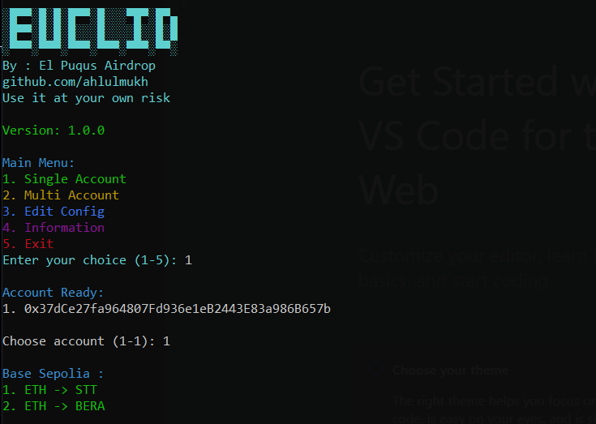

# Euclid Testnet

This guide provides instructions for using the Euclid Testnet tool for automated transactions.



## Requirements

- **Proxy**: Optional, but recommended for enhanced privacy.

## Features

- Base Sepolia Swap
- Auto Updater Tool

## Checking System Architecture

To determine your system architecture, run the following command:

```bash
uname -m
```

- `x86_64`: Use the `linux-amd64` version.
- `aarch64`: Use the `linux-arm64` version.

## Usage Instructions

### For Windows

1. Download the latest release: [Download euclid for Windows](https://raw.githubusercontent.com/ahlulmukh/euclid-bot/main/bin/euclid-bot-windows/euclid-bot.exe).
2. Execute the downloaded file.
3. Enter your private key in the command line when prompted.

### For Linux amd64

1. download file.

   ```bash
   wget https://raw.githubusercontent.com/ahlulmukh/euclid-bot/main/bin/euclid-bot-linux-amd64/euclid-bot-amd64
   ```

2. Give permession.
   ```bash
   chmod +x euclid-linux-amd64
   ```
3. Run it.
   ```bash
   ./euclid-linux-amd64
   ```

### For Linux arm64

1. download file.

   ```bash
   wget https://raw.githubusercontent.com/ahlulmukh/euclid-bot/main/bin/euclid-bot-linux-arm64/euclid-bot-arm64
   ```

2. Give permession.
   ```bash
   chmod +x euclid-linux-arm64
   ```
3. Run it.
   ```bash
   ./euclid-linux-arm64
   ```

## Stay Connected

Stay updated and connect with the community through the following channels:

- **Telegram Channel**: [Join on Telegram](https://t.me/elpuqus)
- **WhatsApp Channel**: [Join on WhatsApp](https://whatsapp.com/channel/0029VavBRhGBqbrEF9vxal1R)
- **Discord Server**: [Join on Discord](https://discord.com/invite/uKM4UCAccY)

## Support the Project

If you find this project helpful and would like to support its development, consider making a donation:

- **Solana**: `5jQMndHzWVH8MCitXdUEYmshJZXVKCzUG12mxJku4WdX`
- **EVM**: `0x72120c3c9cf3fee3ad57a34d5fcdbffe45f4ff28`
- **Bitcoin (BTC)**: `bc1ppfl3w3l4spnda7lawlhlycwuq2ekz74c936c8emwfprfu9hyun6sq5k6xl`

## Disclaimer

This tool is intended for educational purposes only. Use it responsibly and at your own risk.
